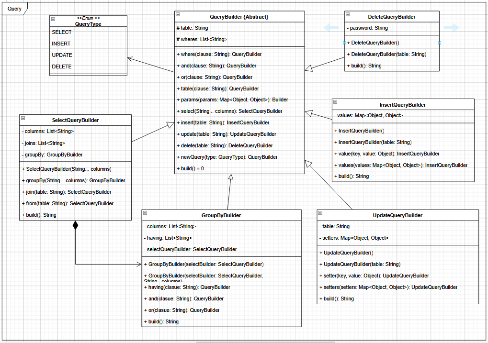
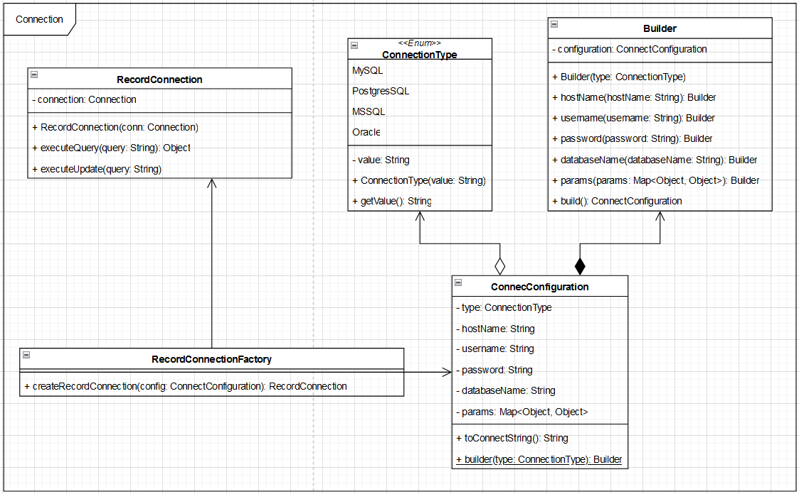

# Database Access Management Framework

As a course project, this repository has been established to implement Data Access Management, packaging it as a framework built on the foundation of JDBC, and incorporating design patterns inspired by the Gang of Four (GoF).

## Basic Information

- Course: Object Oriented Design Patterns and Applications
- Class: 20_3
- Academic year: 2020 - 2024
- Lecturer: Nguyễn Minh Huy
- Project Lecturer: Trần Duy Quang

## Members

| MSSV     | Full Name        |
| -------- | ---------------- |
| 20120032 | Phan Trường An   |
| 20120068 | Phan Duy         |
| 20120075 | Lê Thị Minh Hiền |
| 20120251 | Trần Đức Anh     |

## UML Diagram

### Overall

- [Class Diagram](https://drive.google.com/file/d/1dBQVoJ7GzuXkMR4KHGckE7iK5IZe3B-x/view?usp=sharing)


### Detail

#### Package Query

- Using Builder with Template Method to create String query for Management package use it.



#### Package Connect

- Using Builder to create URL connection and Factory to create variety connection to different type of database.



#### Package Management

- Using Singleton and Factory to public and limit number of connection to database.


## Prerequisite

Project using Maven build tool and java sdk21 so you should download and install it:

- For Maven, follow the [offical instruction](https://maven.apache.org/install.html) or this step by step [guide](https://phoenixnap.com/kb/install-maven-windows)
- For Java sdk, follow this [official instruction](https://docs.oracle.com/en/java/javase/21/install/overview-jdk-installation.html#GUID-8677A77F-231A-40F7-98B9-1FD0B48C346A)

## Installation

Use command line to clone the repository

```bash
$ git clone https://github.com/Erel0251/DAM_project_fit_20_3
```

Move to Java root folder manually through GUI or use CLI `cd dam/` from root directory repository

Build the project

```bash
$ mvn package
```

For more instruction check this: [Maven in five minutes](https://maven.apache.org/guides/getting-started/maven-in-five-minutes.html)

## Example

```java
public class Main {
    public static void main(String[] args) throws OutOfConnectionException, SQLException, InstantiationException, IllegalAccessException, UnsupportedActionException, InvocationTargetException, NoSuchMethodException {
        Map<Object, Object> params = new HashMap<>();
        params.put("createDatabaseIfNotExist", "true");
        ConnectConfiguration configuration = ConnectConfiguration.builder(ConnectionType.MySQL)
                .hostName("localhost:3306")
                .username("benjamin")
                .password("benjamin")
                .databaseName("mtk-demo")
                .params(params)
                .build();
        try {
            Persistence.configureDatasource(configuration);
        } catch (ConnectionException e) {
            System.out.println(e.getMessage());
            throw new RuntimeException(e);
        }
        RecordManagerFactory factory = Persistence.createRecordManagerFactory("simple-dao");
        RecordManager recordManager = factory.createRecordManager();
        QueryBuilder query = QueryBuilder.update("user")
                .setter("username", "hehe")
                .where("id = 3");
        recordManager.executeUpdate(query);
        QueryBuilder insertQuery = QueryBuilder.insert("user")
                .value("username", "test");
        recordManager.executeUpdate(insertQuery);

        User user = new User();
        recordManager.insert(user);
        Persistence.release("simple-dao");
    }
}
```

## Contributing

Pull requests are welcome. For major changes, please open an issue first
to discuss what you would like to change.

Please make sure to update tests as appropriate.

## License

[MIT](https://choosealicense.com/licenses/mit/)